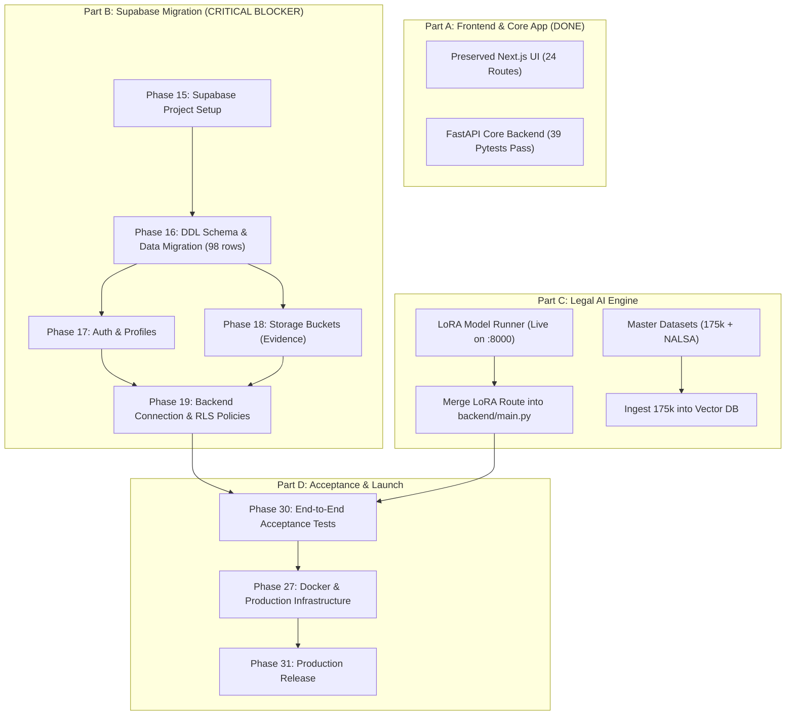

# REMAINING TASKS AND DEPENDENCIES — LEGAL SAATHI

**Project:** Legal Saathi — AI-Powered Legal Assistance Platform  
**Repository:** `E:\Rox\LegalSaathi`  
**Audit Date:** 2026-09-27  

---

## 1. Inventory of Incomplete & Blocked Tasks

### Category A: Unstarted Phases (Part B — Supabase Migration)
* **[Phase 15] Supabase Project Setup:** Provision Supabase cloud project, obtain API credentials, and populate `.env` files.
* **[Phase 16] Database Schema & Migration:** Create PostgreSQL DDL files and migrate 11 tables and 98 existing rows from `legal_saathi.db`.
* **[Phase 17] Authentication & User Profiles:** Install `@supabase/supabase-js` and `@supabase/ssr`, implement email & Google OAuth, replace local JSON user store.
* **[Phase 18] Storage & Dataset Management:** Provision `case-evidence` and `legal-dossiers` buckets in Supabase Storage with signed URL access policies.
* **[Phase 19] Backend Integration & Security:** Reconnect FastAPI from SQLite to Supabase PostgreSQL, write Row Level Security (RLS) policies for all 11 tables.

### Category B: Partially Completed Phases
* **[Phase 5] Frontend Authentication:** Replace mock session cookie in `src/lib/auth/user-store.ts` with Supabase Auth session provider.
* **[Phase 24] RAG & Legal Document Retrieval:** Ingest the 175k compiled dataset into a vector database (Supabase pgvector / Qdrant) alongside the existing BM25 statutory index.
* **[Phase 26] Legal AI Backend Integration:** Unify `api_server.py` into `backend/main.py` (mount under `/api/v1/lora/analyze-case`) to eliminate port conflicts.
* **[Phase 28] Security & Privacy Audit:** Enforce PostgreSQL Row Level Security (RLS) for tenant isolation; configure production key management.

### Category C: Unverified Phases (Requiring Benchmark / Load Testing)
* **[Phase 23] Legal Model Evaluation:** Run a standardized evaluation benchmark (LegalBench-India or 500-question held-out statutory test set) to measure factual accuracy, hallucination rate, and citation precision.
* **[Phase 29] Performance & Reliability:** Perform concurrent load testing (Locust / k6) on the FastAPI backend and LoRA inference engine under 50+ concurrent virtual users.
* **[Phase 30] End-to-End Acceptance Testing:** Execute a full-stack automated browser test suite (Playwright/Cypress) verifying the complete user journey: Landing → Login → Triage → Case Workspace → Evidence Upload → LoRA Analysis → Legal Notice Export.

### Category D: Blocked Phases
* **[Phase 31] Production Release:** Blocked by completion of Part B (Supabase Migration) and Part D (Production Infrastructure).

---

## 2. Missing Dependencies & Environmental Requirements

### Frontend Dependencies to Install:
```bash
npm install @supabase/supabase-js @supabase/ssr
```

### Backend Dependencies to Install:
```bash
pip install supabase psycopg2-binary asyncpg pgvector
```

### Environment Variables Required in `.env`:
```ini
# Supabase Cloud Configuration
NEXT_PUBLIC_SUPABASE_URL=https://<your-project-id>.supabase.co
NEXT_PUBLIC_SUPABASE_ANON_KEY=<your-anon-key>
SUPABASE_SERVICE_ROLE_KEY=<your-service-role-key>
DATABASE_URL=postgresql+asyncpg://postgres:<password>@db.<your-project-id>.supabase.co:5432/postgres

# Production AI Settings
LORA_INFERENCE_URL=http://127.0.0.1:8001
GEMINI_API_KEY=<your-gemini-key>
```

---

## 3. Dependency Graph & Task Precedence



---

## 4. Recommended Execution Roadmap

To minimize risk and strictly preserve the already developed frontend and passing backend tests, work should proceed in the following 4 structured sprints:

### Sprint 1: Supabase Foundation & Data Migration (Phases 15–19)
1. **Acquire Credentials:** Set up Supabase project and populate `.env`.
2. **PostgreSQL Schema:** Create DDL migrations reproducing the 11 SQLite tables.
3. **Data Transfer:** Migrate the 98 active records with foreign key integrity.
4. **Provision Storage:** Create `case-evidence` and `legal-dossiers` buckets.
5. **Enable RLS:** Apply tenant isolation policies across all tables.

### Sprint 2: Frontend & Backend Auth Wiring (Phase 5, 17, 19)
1. Wire `@supabase/ssr` into `src/middleware.ts` and Next.js server components without changing visual layouts.
2. Update `backend/database/session.py` to target Supabase PostgreSQL.
3. Re-run `python -m pytest backend/tests` to confirm 39/39 tests continue passing on PostgreSQL.

### Sprint 3: Legal AI Unified Integration (Phases 22, 24, 26)
1. Mount the LoRA inference router inside `backend/main.py` under `/api/v1/lora/analyze-case`.
2. Re-point Next.js Case Workspace to the unified backend endpoint.
3. Connect RAG retrieval to vector storage over the 175k compiled dataset.

### Sprint 4: QA, Acceptance & Deployment (Phases 23, 27–31)
1. Run quantitative evaluation benchmark on the fine-tuned LoRA model.
2. Execute full end-to-end Playwright acceptance suite.
3. Build production Docker images and launch.
