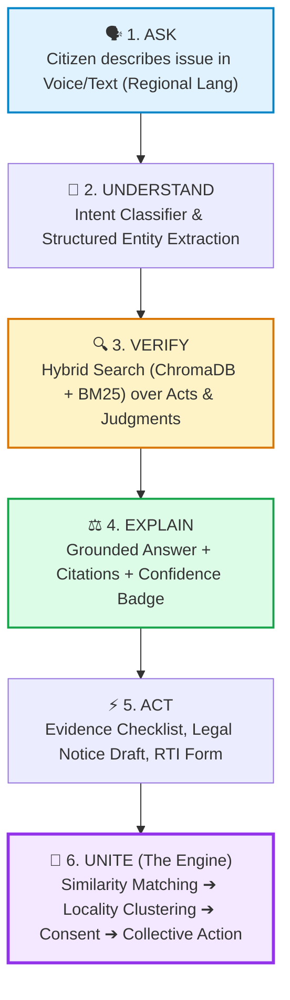
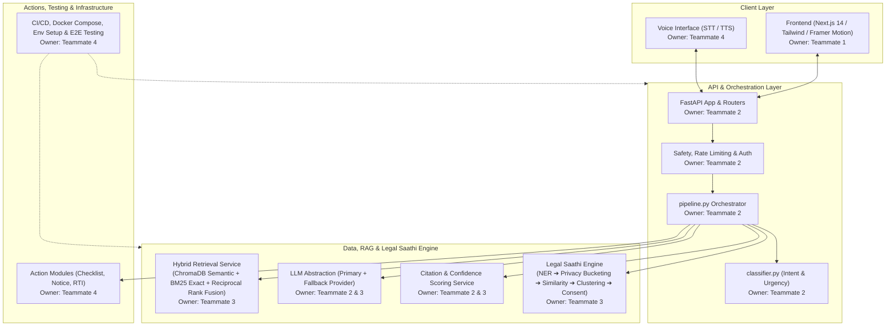
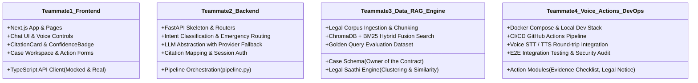
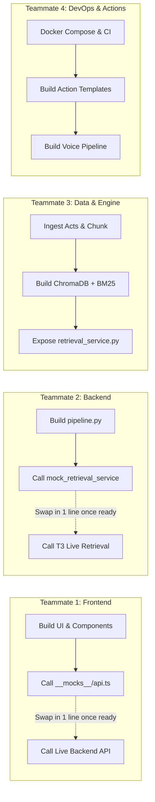
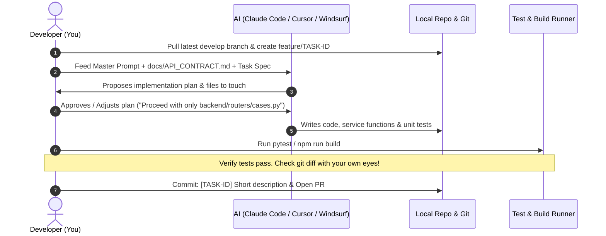

# Legal Saathi — 4-Developer Team Kick-off & Vibe Coding Playbook

> **Meeting Objective:** Align all 4 developers on the product vision, system architecture, exact role assignments, the critical execution path, and the **AI-assisted "Vibe Coding" workflow** to build Legal Saathi at maximum speed without stepping on each other's toes.

---

## 1. The 60-Second Team Hook

> *"Every legal chatbot out there is a toy that hallucinates generic legal advice. **Legal Saathi is an evidence-grounded legal copilot for real citizens.** It takes a problem in Hindi, Tamil, or English via voice or text, pulls actual Indian legal Acts and judgments, provides a cited answer with a clear confidence badge, hands the user a ready-to-file legal notice or evidence checklist, and—here is our killer differentiator—**connects individual complaints into collective legal action patterns** with privacy-first consent."*

### Why We Will Win (Generic AI vs. Legal Saathi)

| Feature | Generic Legal Chatbot (The Toys) | Legal Saathi (Our System) |
|---|---|---|
| **Knowledge Source** | LLM's hallucinated internal training | **Dual Hybrid Retrieval** (ChromaDB Vector + BM25 Lexical) |
| **Trust & Verification** | Zero citations, blind trust | **Claim-to-Source Citation Layer** + Confidence Badge (Strong / Partial / Insufficient) |
| **User Output** | Dead-end generic text advice | **Action Modules** (Evidence Checklist, Legal Notice Draft, RTI, DLSA) |
| **Community Impact** | Treats every user as isolated | **Legal Saathi Engine** (Detects recurring patterns across users & enables collective action) |
| **Accessibility** | English-heavy, text-only form | **Voice-first & Multilingual** for regional language citizens |
| **State & Memory** | Ephemeral, forgotten on reload | **Structured Case Schema** (Persisted entities, dates, opposing party, amounts) |

---

## 2. The Core User Journey



---

## 3. High-Level System Architecture



---

## 4. Team Structure & Work Distribution (The 4-Dev Split)

We have split the architecture along natural boundaries so **nobody waits for someone else** to start coding.



### Responsibility & File Ownership Matrix

| Domain | Teammate 1 (Frontend) | Teammate 2 (Backend) | Teammate 3 (RAG / Engine) | Teammate 4 (Voice / DevOps) | Primary Owner |
|---|:---:|:---:|:---:|:---:|:---:|
| **Frontend UI/UX** | **LEAD** | Review API shape | — | A11y & UI QA | **T1** |
| **API Endpoints & Orchestration** | Client integration | **LEAD** | Expose services | — | **T2** |
| **Hybrid RAG (Chroma + BM25)** | — | Consumes search | **LEAD** | — | **T3** |
| **Case Schema Contract** | Consumes types | Consumes DB model | **LEAD & OWNER** | Seed data testing | **T3** |
| **Citation & Trust Layer** | Renders Badges | **LEAD (Logic)** | Source metadata | Review | **T2** |
| **Legal Saathi Engine** | Consent & Cluster UI | Endpoints | **LEAD** | Privacy audit | **T3** |
| **Action Modules (Checklist/Notice)** | Action Forms | Action Endpoints | Taxonomy support | **LEAD** | **T4** |
| **Voice (STT / TTS)** | Audio UI / Mic | Audio Webhooks | — | **LEAD** | **T4** |
| **Docker, CI/CD & Deploy** | — | App packaging | Vector DB volume | **LEAD** | **T4** |
| **E2E & Security Testing** | Component tests | Unit/API tests | Precision tests | **LEAD (E2E & Sec)** | **T4** |

---

## 5. How We Parallelize Without Blocking: The Mocking Strategy

The biggest trap in hackathons is: *"I'm waiting for the backend endpoint before I can build the UI"* or *"I'm waiting for the RAG index before I can write the pipeline."* 

**We outlaw blocking.** Everyone starts day one using frozen contracts and fixtures:



1. **T1 (Frontend):** Builds the entire Chat UI, Citation Cards, and Action Forms immediately using mock JSON responses defined in `docs/API_CONTRACT.md`.
2. **T2 (Backend):** Builds `pipeline.py` using a hardcoded `mock_retrieval_service()` that returns 3 canned legal chunks.
3. **T3 (Data/RAG):** Ingests documents and tunes ChromaDB + BM25 independently without caring about the web server.
4. **T4 (DevOps/Actions):** Sets up Docker Compose and writes the Evidence Checklist templates against `CASE_SCHEMA.md`.

---

## 6. The "Full Vibe Coding" Playbook: How We Code with AI

> **What is "Vibe Coding"?** 
> Vibe coding is NOT blindly prompting an AI and pasting whatever code it generates. 
> In Legal Saathi, **Vibe Coding means: Humans act as Architects and Tech Leads; AI acts as our hyper-fast junior developers.** We maintain velocity without breaking the codebase.

### The 6 Golden Laws of Vibe Coding on Legal Saathi

```
  ┌────────────────────────────────────────────────────────────────────────┐
  │                   THE 6 LAWS OF LEGAL SAATHI VIBE CODING               │
  ├────────────────────────────────────────────────────────────────────────┤
  │ 1. NEVER let AI invent API schemas or DB models on the fly.            │
  │    (All schemas come from docs/CASE_SCHEMA.md & docs/API_CONTRACT.md)  │
  │ 2. ONE Task ID per prompt session. Do not say "build the chat app".    │
  │ 3. ALWAYS feed context files at the start of every session.            │
  │ 4. NEVER let AI delete or refactor a teammate's working file.          │
  │ 5. AI must write tests and run build checks BEFORE you mark done.      │
  │ 6. Shared contracts are IMMUTABLE without a team live sync.            │
  └────────────────────────────────────────────────────────────────────────┘
```

### The 5-Step AI Coding Loop (Every Teammate, Every Task)



---

### Ready-to-Copy Master Prompts for Each Teammate

*Copy and paste your designated master prompt into your AI coding tool (Claude Code, Cursor, Windsurf) at the beginning of each session.*

#### 💻 Teammate 1 (Frontend / UI) Master Prompt
```text
You are Teammate 1 (Frontend Lead) on the Legal Saathi project.
Stack: Next.js 14 (App Router), TypeScript, Tailwind CSS, Framer Motion, Lucide Icons.
Documents to strictly respect:
- docs/legal-saathi-blueprint.md (UI/UX design, Section 9 & 21)
- docs/API_CONTRACT.md (API request/response shapes)
- docs/CASE_SCHEMA.md (Case object TypeScript interface)

Your Boundaries:
- You own: frontend/app/*, frontend/components/*, frontend/lib/api-client.ts, frontend/types/*
- You DO NOT modify backend/, scripts/, or database models.
- If a backend endpoint is not ready, code against a fixture in frontend/lib/__mocks__/ matching docs/API_CONTRACT.md.
- Ensure every async view has 3 states: Loading (skeleton), Error (friendly retry), and Empty.
- Include accessibility: large tap targets, high contrast, audio waveform feedback.

Task to work on: [INSERT TASK-ID e.g., CORE-011: Chat UI + CitationCard + ConfidenceBadge]
Before writing code: inspect existing components. Report what files you will create/modify.
After writing code: run `npm run build` or typecheck, and list all modified files.
```

#### ⚙️ Teammate 2 (Backend & Orchestration) Master Prompt
```text
You are Teammate 2 (Backend Lead) on the Legal Saathi project.
Stack: Python 3.11+, FastAPI, Pydantic v2, SQLAlchemy/SQLModel.
Documents to strictly respect:
- docs/legal-saathi-blueprint.md (Sections 5, 6, 10, 12, 18)
- docs/API_CONTRACT.md (Exact router paths & JSON shapes)
- docs/CASE_SCHEMA.md (Pydantic model for Case)

Your Boundaries:
- You own: backend/routers/*, backend/services/pipeline.py, backend/services/classifier.py, backend/services/llm_provider.py, backend/services/citation_service.py
- You consume T3's backend/services/retrieval_service.py as a black box interface. Do not modify its internals.
- Implement strict fallback for LLMs (Primary provider with fallback to backup if timeout > 8s).
- Implement emergency/high-risk routing in classifier.py: if danger/violence detected, route immediately to emergency response and skip ordinary chat.

Task to work on: [INSERT TASK-ID e.g., CORE-009: Pipeline Orchestration]
Before writing code: inspect existing schemas. Only implement the specified endpoint/service.
After writing code: write unit tests using pytest, run pytest, and confirm all pass.
```

#### 🧠 Teammate 3 (Data / Hybrid RAG / Engine) Master Prompt
```text
You are Teammate 3 (AI/RAG & Legal Saathi Engine Lead) on Legal Saathi.
Stack: Python 3.11+, ChromaDB, Rank-BM25, LangChain/LlamaIndex chunking utilities, Sentence-Transformers.
Documents to strictly respect:
- docs/legal-saathi-blueprint.md (Section 7 RAG, Section 8 Legal Saathi Engine)
- docs/CASE_SCHEMA.md (You OWN this contract)

Your Boundaries:
- You own: scripts/ingest_corpus.py, backend/services/retrieval_service.py, backend/services/engine/*, data/raw/*, data/eval/*
- Expose `retrieval_service.search(query, corpus, top_k)` returning ranked chunks with metadata.
- Implement Reciprocal Rank Fusion (RRF) between ChromaDB semantic search and BM25 lexical search.
- For the Engine: build entity normalization, similarity scoring with human-readable explanations, and privacy-first bucketing (hash/bucket PII before comparing across cases).
- Create a golden query evaluation set (`data/eval/golden_queries.json`) with at least 15 queries to measure precision.

Task to work on: [INSERT TASK-ID e.g., CORE-006: ChromaDB + BM25 Hybrid Index & Fusion]
Before writing code: verify data folder structures. Never expose raw un-anonymized PII across cases.
After writing code: run the precision script and report precision@5.
```

#### 🚀 Teammate 4 (Voice / Action Modules / DevOps / QA) Master Prompt
```text
You are Teammate 4 (DevOps, Voice, Action Modules & QA Lead) on Legal Saathi.
Stack: Docker Compose, GitHub Actions, Playwright/Cypress for E2E, FastAPI action routers, Whisper/Bhashini STT/TTS.
Documents to strictly respect:
- docs/legal-saathi-blueprint.md (Sections 17-20: Actions, Voice, DevOps, Security)
- docs/PROJECT_DEVELOPMENT_ROADMAP.md (Parts 10 Security & 11 Testing)

Your Boundaries:
- Phase 2-3 Focus: docker-compose.yml (FE + BE + ChromaDB), CI pipeline (.github/workflows/ci.yml), dev setup.
- Phase 4+ Focus: Action Modules (backend/routers/actions/* - Evidence Checklist first, then Notice draft), Voice pipeline (STT -> clean -> pipeline -> TTS), E2E testing scripts.
- You are the Quality and Security gatekeeper: verify rate limiting, secret isolation, and that no PII is leaked in logs or cluster endpoints.

Task to work on: [INSERT TASK-ID e.g., DEVOPS-001: Docker Compose Local Stack + CI]
Before writing code: check environment variables template (.env.example).
After writing code: test container startup and run full test suites.
```

---

## 7. The Master Execution Roadmap (Phase 0 to 10)

```mermaid
gantt
    title Legal Saathi Hackathon Execution Timeline
    dateFormat  X
    axisFormat Day %d

    section Foundations
    Phase 0: Repo Audit (All 4)           :done,    p0, 0, 1
    Phase 1: Freeze Schema & API (All 4)  :done,    p1, 1, 2
    Phase 2: Skeletons & Docker (Parallel):active,  p2, 2, 3

    section Core Critical Path
    Phase 3: Case Schema & Corpus Ingest  :crit,    p3, 3, 5
    Phase 4: Milestone 1 Grounded Answer  :crit,    p4, 5, 8

    section Feature Expansion
    Phase 5: Case Workspace & Checklist   :         p5, 8, 10
    Phase 6: Legal Notice / RTI Actions   :         p6, 10, 12
    Phase 7: Voice & Engine v1 (Parallel) :         p7, 10, 13
    Phase 8: Collective Workflow          :         p8, 13, 15

    section Polish & Demo
    Phase 9: Testing & Security Audit     :         p9, 15, 16
    Phase 10: Demo Rehearsal & Buffer     :         p10, 16, 17
```

### The Non-Negotiable Bottleneck: Phase 4 (Milestone 1)
> ⚠️ **CRITICAL WARNING FOR THE TEAM:** 
> Phase 4 is our absolute linchpin. It connects:
> `User Question ➔ Intent ➔ Legal Retrieval ➔ Grounded Answer ➔ Citations ➔ Confidence Badge`.
> If Phase 4 slips, **do not add new features**. Cut P2 scope immediately. Everything in Phase 5–8 depends on Phase 4 working flawlessly.

---

## 8. Git & Branching Hygiene for 4 Vibe Coders

To prevent Git chaos when 4 people use AI tools:

1. **Branch Naming:** `feature/<TASK-ID>-<short-name>`  
   *(e.g., `feature/core-009-pipeline-orchestration`)*
2. **Commit Messages:** `[<TASK-ID>] <Clear description of what changed>`  
   *(e.g., `[CORE-009] Implement pipeline orchestration with fallback LLM provider`)*
3. **Cross-Review Rule:** Backend PRs must be reviewed by T1 (Frontend) or T3 (RAG). Frontend PRs reviewed by T2.
4. **Contract Modification Rule:** **ZERO tolerance** for editing `docs/CASE_SCHEMA.md` or `docs/API_CONTRACT.md` without an explicit 5-minute huddle with all 4 devs.

---

## 9. The Winning Demo Story (What We Will Show)

When we present to judges or investors, we walk through **one real human story**:

```
1. Citizen speaks in Hindi: 
   "मेरा मकान मालिक 2 महीने बाद भी 40,000 का सिक्योरिटी डिपॉजिट वापस नहीं कर रहा है।"
   (My landlord has not returned my ₹40,000 security deposit even after 2 months.)
               │
               ▼
2. System Transcribes & Normalizes ➔ Extracts:
   - Issue: Tenancy / Security Deposit Withholding
   - Amount: ₹40,000 | Opposing Party: Landlord | Timeline: 2 months post-vacate
               │
               ▼
3. Hybrid Search pulls Model Tenancy Act & State Rent Control clauses & Case Law
               │
               ▼
4. Grounded Explanation generated with:
   - Green Badge: [STRONG EVIDENCE]
   - Expandable Citation: Section 13(2), Model Tenancy Act
   - "Why this applies to you": Explains landlord notice requirements
               │
               ▼
5. Instant Action Offered:
   - [Evidence Checklist]: Rent agreement, bank statement, key handover receipt
   - [Generate Legal Notice]: 1-click pre-filled formal demand notice
               │
               ▼
6. The "Holy Sh*t" Moment — The Legal Saathi Engine:
   - "4 other tenants in your locality (Indiranagar) reported deposit withholding by this same property firm."
   - Privacy Banner: Aggregate pattern shown first.
   - 1-Click Consent: "Join collective legal notice" ➔ Amplifies their leverage 10x!
```

---

## 10. Meeting Agenda & Action Items (Start Right Now!)

### 45-Minute Kick-Off Meeting Agenda
1. **00–10m:** Pitch the Vision & Demo Story (Walk through Section 1 & 9).
2. **10–20m:** Architecture & Role Confirmation (Walk through Section 3 & 4).
3. **20–30m:** Vibe Coding Rules & Prompts (Walk through Section 6 — ensure everyone saves their prompt).
4. **30–40m:** Phase 0 Repo Audit Kick-off (Each person spends 30 mins auditing their area).
5. **40–45m:** Q&A and commit to Phase 1 Contract Freeze by end of day.

### Immediate Action Items for Today
- [ ] **Teammate 1:** Audit frontend folders, check existing UI components, review API contract mock needs.
- [ ] **Teammate 2:** Audit `backend/` (`classifier.py`, `pipeline.py`), verify if FastAPI app runs locally.
- [ ] **Teammate 3:** Check ChromaDB dependencies, inspect `data/` folder, gather first 10 Act sections.
- [ ] **Teammate 4:** Build `docker-compose.yml` and `.env.example`, ensure everyone can run `docker compose up`.
