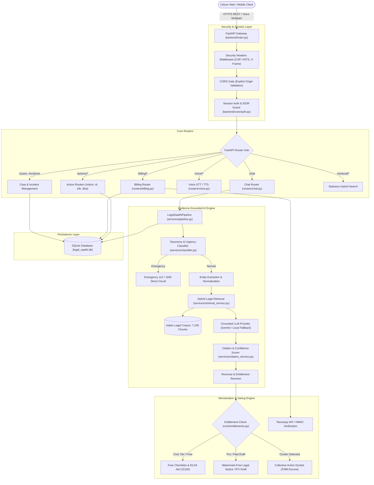
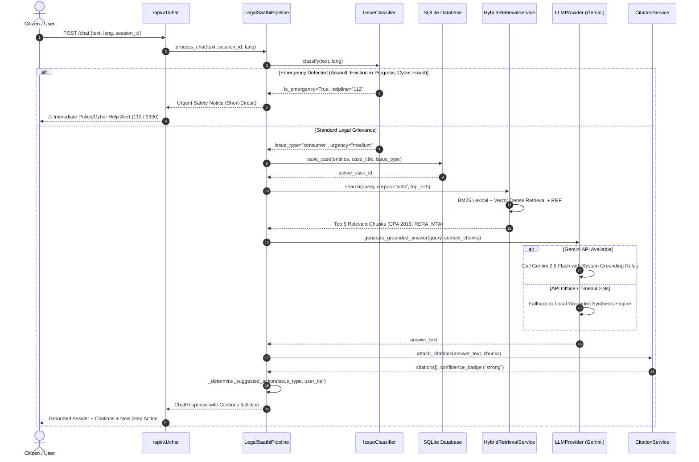
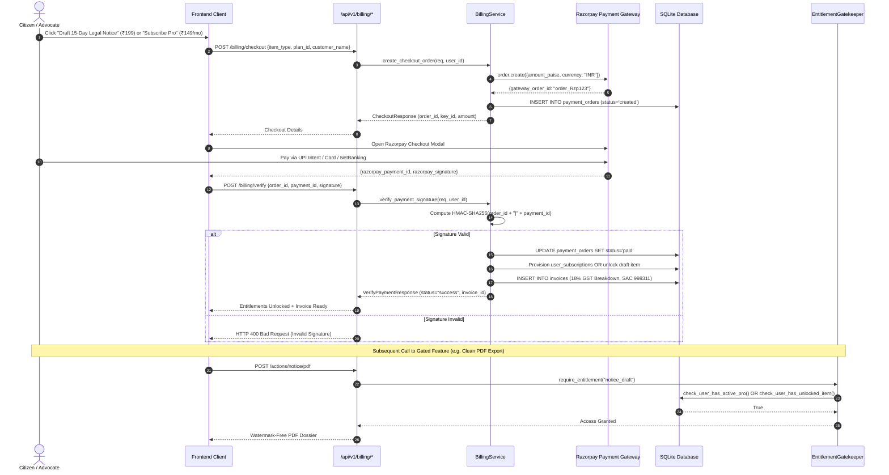
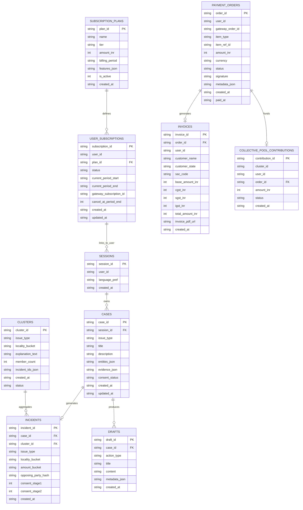
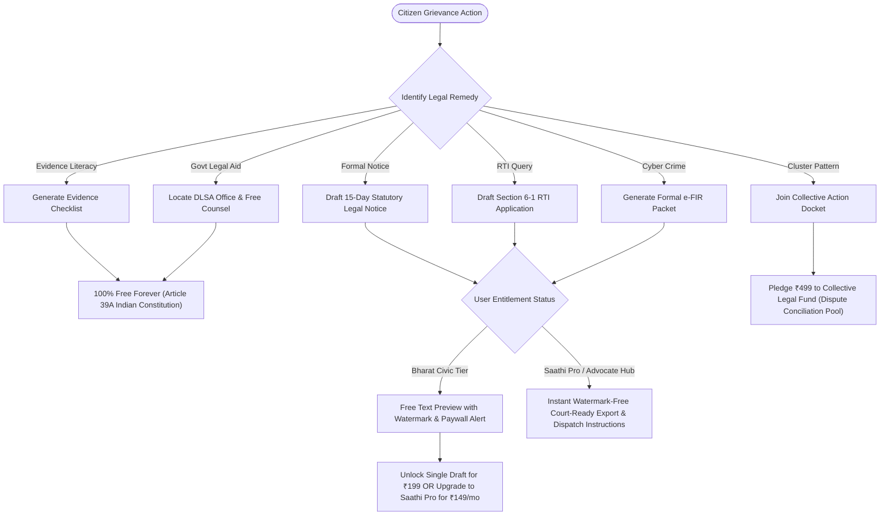

# Legal Saathi — Backend Architecture & System Workflow

**Document Version:** 1.0  
**Stack:** FastAPI / Python 3.10+ / SQLite / Hybrid Retrieval (BM25 + ChromaDB) / Razorpay Gateway / Google Gemini 2.5 Flash  
**Compliance Standard:** Advocates Act 1961 | BCI Rules | GST SAC 998311 | ISO/IEC 27001 Security Headers  

---

## 1. High-Level System Architecture

The following diagram illustrates how incoming client requests flow through security middleware, session authentication, the AI evidence pipeline, action drafting modules, billing systems, and the underlying persistence layer:



---

## 2. Evidence-Grounded AI Pipeline Workflow

The complete sequence diagram detailing how a citizen prompt is classified, cross-referenced against Indian Bare Acts, and synthesized with exact claim citations:



---

## 3. Revenue, Billing & Entitlement Flowchart

The payment processing, cryptographic signature verification, entitlement provisioning, and automated GST invoicing sequence:



---

## 4. Relational Database Schema (Entity-Relationship Diagram)

The database schema persisted in [`backend/data/db.py`](file:///c:/Users/puruk/Downloads/New%20folder/legal%20saathi/backend/data/db.py):



---

## 5. Action Modules & Entitlement Gatekeeper Tree

How different citizen actions are partitioned into free public services versus paid professional tools:



---

## 6. End-to-End API Route Directory

All routes are mounted at both root (`/`) and under `/api/v1/`:

| Path | Method | Description | Access Tier | Gated By |
| :--- | :--- | :--- | :--- | :--- |
| `/chat` | `POST` | Evidence-grounded AI legal advice with citations | Civic (Free) | None |
| `/voice/stt` | `POST` | Multilingual Whisper speech-to-text | Civic (Free) | Rate Limit |
| `/voice/tts` | `POST` | Natural audio voice generation | Civic (Free) | Rate Limit |
| `/retrieval/search` | `POST` | Hybrid search across Bare Acts and Judgments | Civic (Free) | None |
| `/cases` | `GET/POST` | Case dossier creation and ownership retrieval | Civic (Free) | Session Ownership |
| `/incidents` | `POST` | Anonymized grievance logging for cluster discovery | Civic (Free) | Consent Flag |
| `/clustering/run` | `POST` | Run density-based community grievance grouping | Public / Admin | None |
| `/actions/checklist` | `POST` | Procedural document checklists | Civic (Free) | **Free Forever** |
| `/actions/dlsa` | `POST` | NALSA / DLSA free legal aid locator | Civic (Free) | **Free Forever** |
| `/actions/notice` | `POST` | 15-day statutory legal notice generator | Freemium | Watermark if unpaid |
| `/actions/notice/pdf` | `POST` | Watermark-free court-ready PDF notice | Premium | `require_entitlement` (402) |
| `/actions/rti` | `POST` | Section 6(1) RTI application generator | Freemium | Watermark if unpaid |
| `/actions/efir` | `POST` | Formal cyber fraud / e-FIR complaint packet | Freemium | Watermark if unpaid |
| `/billing/plans` | `GET` | List active subscription plans and features | Public | None |
| `/billing/checkout` | `POST` | Create Razorpay order for subscription or single draft | Public | Session Auth |
| `/billing/verify` | `POST` | HMAC-SHA256 signature verification and unlock | Authenticated | Valid HMAC |
| `/billing/subscription` | `GET` | Current tier, expiry, and allowed draft status | Authenticated | Session Auth |
| `/billing/invoices` | `GET` | GST-compliant tax receipts (SAC 998311) | Authenticated | Session Auth |
| `/billing/collective/pledge` | `POST` | Group action escrow contribution (₹499) | Authenticated | Session Auth |
| `/billing/webhook` | `POST` | Asynchronous Razorpay gateway webhook | Gateway | Webhook HMAC |

---

## 7. Local Execution & Validation Guide

### Start Development Server
```powershell
.\backend\venv\Scripts\python.exe -m uvicorn backend.main:app --host 0.0.0.0 --port 8000 --reload
```

* **Interactive Swagger UI:** Visit [`http://localhost:8000/docs`](http://localhost:8000/docs)
* **ReDoc Documentation:** Visit [`http://localhost:8000/redoc`](http://localhost:8000/redoc)

### Run Automated Tests
```powershell
.\backend\venv\Scripts\python.exe -m pytest -q
# Output: 39 passed in 1.89s
```

### Run Dataset Acquisition Pipeline & Golden Retrieval Benchmark
```powershell
.\backend\venv\Scripts\python.exe scripts/run_dataset_pipeline.py
# Output: 100% recall (15/15 golden eval queries) across 7,144 master legal records.
```
