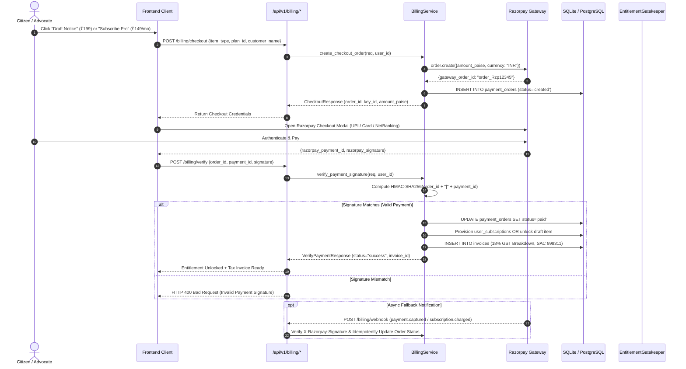
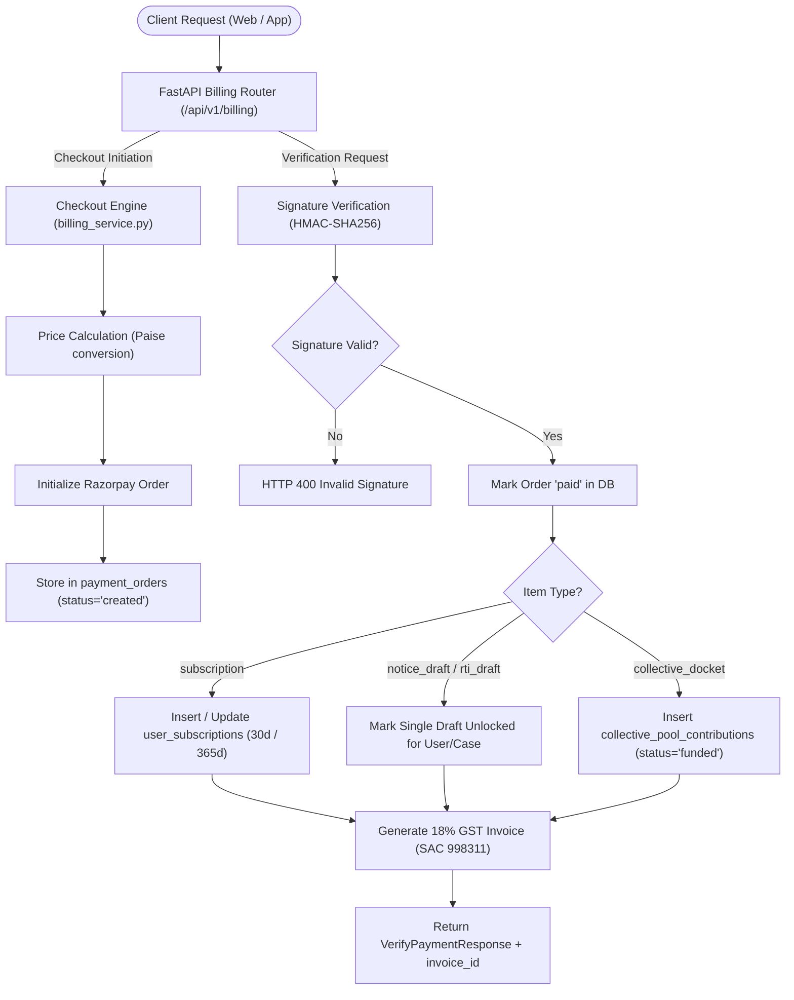
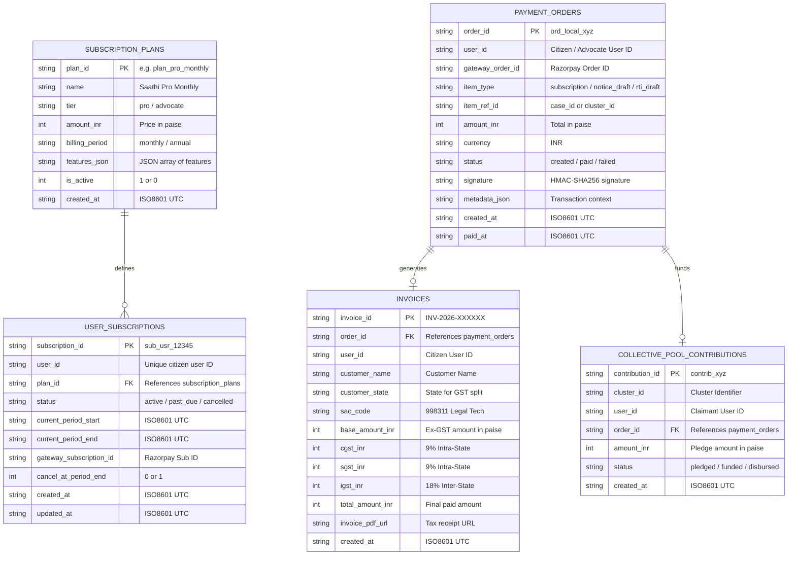
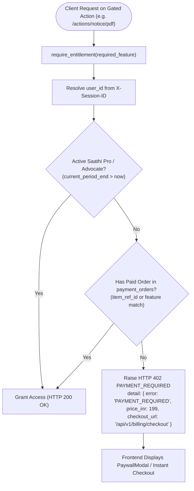

# Legal Saathi — Revenue & Billing Backend Specification

**Document Version:** 1.0  
**Target Environment:** FastAPI / Python 3.10+ / SQLite & PostgreSQL  
**Payment Gateway:** Razorpay / Cashfree (UPI Intent, Cards, NetBanking, UPI AutoPay)  
**Tax & Compliance Standard:** GST SAC Code 998311 | Advocates Act, 1961 | Bar Council of India (BCI) Rules  

---

## 1. Architectural Overview

The backend billing engine manages the financial lifecycle of Legal Saathi across three distinct revenue modalities:
1. **A La Carte Micro-Transactions:** One-time payments (₹199 – ₹299) for automated document generation (Legal Notices, RTI, e-FIR).
2. **Recurring Subscriptions:** Citizen "Saathi Pro" (₹149/mo or ₹1,299/yr) and Lawyer "Advocate Practice Hub" (₹1,499/mo or ₹3,499/mo) with automated recurring billing via UPI AutoPay / e-Mandate.
3. **Collective Action Dockets:** Group litigation & conciliation escrow pools (₹499 – ₹1,499 per claimant).

### 1.1 End-to-End Billing Lifecycle (Sequence Diagram)



### 1.2 Backend Component Flowchart



---

## 2. Database Schema (DDL)

The relational data model supporting subscription plans, user subscriptions, payment transactions, GST invoices, and collective litigation pools:



Add these tables to [`backend/data/db.py`](file:///c:/Users/puruk/Downloads/New%20folder/legal%20saathi/backend/data/db.py):

```sql
-- 1. Subscription Plans Master
CREATE TABLE IF NOT EXISTS subscription_plans (
    plan_id TEXT PRIMARY KEY,               -- 'plan_free', 'plan_pro_monthly', 'plan_pro_annual', 'plan_advocate_starter'
    name TEXT NOT NULL,                     -- 'Bharat Civic Access', 'Saathi Pro', 'Advocate Practice Hub'
    tier TEXT NOT NULL,                     -- 'civic', 'pro', 'advocate', 'enterprise'
    amount_inr INTEGER NOT NULL,            -- Price in paise (e.g. 14900 for ₹149.00)
    billing_period TEXT NOT NULL,           -- 'one_time', 'monthly', 'annual'
    features_json TEXT NOT NULL,            -- JSON array of entitlements
    is_active INTEGER DEFAULT 1,
    created_at TEXT NOT NULL
);

-- 2. User Subscriptions Table
CREATE TABLE IF NOT EXISTS user_subscriptions (
    subscription_id TEXT PRIMARY KEY,       -- Internal ID: 'sub_usr_12345'
    user_id TEXT NOT NULL,
    plan_id TEXT NOT NULL,
    status TEXT NOT NULL,                   -- 'active', 'past_due', 'cancelled', 'expired'
    current_period_start TEXT NOT NULL,     -- ISO8601 UTC
    current_period_end TEXT NOT NULL,       -- ISO8601 UTC
    gateway_subscription_id TEXT,           -- Razorpay sub_id for AutoPay
    cancel_at_period_end INTEGER DEFAULT 0,
    created_at TEXT NOT NULL,
    updated_at TEXT NOT NULL,
    FOREIGN KEY (plan_id) REFERENCES subscription_plans(plan_id)
);

-- 3. Payment Orders & Transactions
CREATE TABLE IF NOT EXISTS payment_orders (
    order_id TEXT PRIMARY KEY,              -- 'ord_local_xyz'
    user_id TEXT NOT NULL,
    gateway_order_id TEXT UNIQUE,           -- 'order_Rzp12345678'
    item_type TEXT NOT NULL,                -- 'subscription', 'notice_draft', 'rti_draft', 'efir_draft', 'collective_docket'
    item_ref_id TEXT,                       -- case_id or cluster_id
    amount_inr INTEGER NOT NULL,            -- In paise
    currency TEXT DEFAULT 'INR',
    status TEXT NOT NULL,                   -- 'created', 'paid', 'failed', 'refunded'
    signature TEXT,                         -- Razorpay signature
    metadata_json TEXT,                     -- Additional transaction context
    created_at TEXT NOT NULL,
    paid_at TEXT
);

-- 4. Invoices Table (GST Compliant)
CREATE TABLE IF NOT EXISTS invoices (
    invoice_id TEXT PRIMARY KEY,            -- 'INV-2026-00001'
    order_id TEXT UNIQUE,
    user_id TEXT NOT NULL,
    customer_name TEXT,
    customer_state TEXT DEFAULT 'Delhi',
    sac_code TEXT DEFAULT '998311',         -- Legal Advisory & Document Automation
    base_amount_inr INTEGER NOT NULL,       -- In paise
    cgst_inr INTEGER DEFAULT 0,             -- 9% if intra-state
    sgst_inr INTEGER DEFAULT 0,             -- 9% if intra-state
    igst_inr INTEGER DEFAULT 0,             -- 18% if inter-state
    total_amount_inr INTEGER NOT NULL,      -- In paise
    invoice_pdf_url TEXT,
    created_at TEXT NOT NULL,
    FOREIGN KEY (order_id) REFERENCES payment_orders(order_id)
);

-- 5. Collective Action Pool Contributions
CREATE TABLE IF NOT EXISTS collective_pool_contributions (
    contribution_id TEXT PRIMARY KEY,       -- 'contrib_xyz'
    cluster_id TEXT NOT NULL,
    user_id TEXT NOT NULL,
    order_id TEXT UNIQUE,
    amount_inr INTEGER NOT NULL,
    status TEXT DEFAULT 'pledged',          -- 'pledged', 'funded', 'refunded', 'disbursed'
    created_at TEXT NOT NULL,
    FOREIGN KEY (order_id) REFERENCES payment_orders(order_id)
);
```

---

## 3. Pydantic Schemas (`backend/schemas/billing.py`)

```python
from datetime import datetime
from typing import Any, Dict, List, Literal, Optional
from pydantic import BaseModel, Field


class PlanResponse(BaseModel):
    plan_id: str
    name: str
    tier: Literal["civic", "pro", "advocate", "enterprise"]
    amount_inr: int  # in Rupees
    billing_period: Literal["one_time", "monthly", "annual"]
    features: List[str]
    is_active: bool


class CreateCheckoutRequest(BaseModel):
    item_type: Literal["subscription", "notice_draft", "rti_draft", "efir_draft", "collective_docket"]
    plan_id: Optional[str] = None
    item_ref_id: Optional[str] = None  # case_id or cluster_id
    customer_name: Optional[str] = "Citizen User"
    customer_email: Optional[str] = None
    customer_phone: Optional[str] = None


class CheckoutResponse(BaseModel):
    order_id: str                   # Internal Order ID
    gateway_order_id: str           # Razorpay Order ID
    amount_inr: int                 # Amount in Rupees
    currency: str = "INR"
    key_id: str                     # Razorpay Public Key ID
    item_type: str
    customer_name: Optional[str]
    customer_phone: Optional[str]


class VerifyPaymentRequest(BaseModel):
    order_id: str
    razorpay_order_id: str
    razorpay_payment_id: str
    razorpay_signature: str


class VerifyPaymentResponse(BaseModel):
    status: Literal["success", "failed"]
    order_id: str
    item_type: str
    unlocked_entitlement: str
    message: str


class SubscriptionStatusResponse(BaseModel):
    tier: Literal["civic", "pro", "advocate", "enterprise"]
    plan_name: str
    is_active: bool
    current_period_end: Optional[str]
    allowed_drafts_remaining: Any  # int or "unlimited"
    can_export_pdf_dossier: bool
    can_access_collective_dockets: bool


class InvoiceItemResponse(BaseModel):
    invoice_id: str
    order_id: str
    base_amount_inr: float
    gst_amount_inr: float
    total_amount_inr: float
    created_at: str
    invoice_pdf_url: Optional[str]
```

---

## 4. API Endpoints (`backend/routers/billing.py`)

### 1. `GET /api/v1/billing/plans`
* **Purpose:** Public endpoint providing plan cards, features, and prices for frontend UI.
* **Response:** List of `PlanResponse` models.

### 2. `POST /api/v1/billing/checkout`
* **Purpose:** Initializes order in Razorpay and registers an internal order in `payment_orders`.
* **Request:** `CreateCheckoutRequest`
* **Logic:**
  1. Calculate exact price based on `item_type` or `plan_id`.
  2. Call `razorpay_client.order.create({"amount": amount_paise, "currency": "INR", "receipt": order_id})`.
  3. Store in `payment_orders` with status `'created'`.
  4. Return `CheckoutResponse` containing public Razorpay credentials for the client popup.

### 3. `POST /api/v1/billing/verify`
* **Purpose:** Verifies payment authenticity via cryptographic HMAC-SHA256 signature.
* **Request:** `VerifyPaymentRequest`
* **Signature Verification Algorithm:**
  ```python
  expected_signature = hmac.new(
      settings.RAZORPAY_KEY_SECRET.encode("utf-8"),
      f"{req.razorpay_order_id}|{req.razorpay_payment_id}".encode("utf-8"),
      hashlib.sha256
  ).hexdigest()
  
  if expected_signature != req.razorpay_signature:
      raise HTTPException(status_code=400, detail="Invalid Payment Signature")
  ```
* **Post-Payment Execution:**
  * Update order status to `'paid'`.
  * If subscription: Insert/Update `user_subscriptions` (current date + 30 days or + 365 days).
  * If single draft: Mark `cases.evidence_json` or case metadata with `unlocked_draft=True`.
  * Trigger automated GST invoice creation in `invoices` table.

### 4. `POST /api/v1/billing/webhook`
* **Purpose:** Receives asynchronous gateway notifications (e.g. `subscription.charged`, `payment.failed`).
* **Headers:** `X-Razorpay-Signature`
* **Security:** Cryptographic verification using `RAZORPAY_WEBHOOK_SECRET`.
* **Idempotency:** Webhook event ID is checked against a processed events cache to avoid double crediting.

### 5. `GET /api/v1/billing/subscription`
* **Purpose:** Returns active entitlements for logged-in session/user.

### 6. `GET /api/v1/billing/invoices`
* **Purpose:** Lists historical tax receipts with GST breakdown.

---

## 5. Entitlement & Access Gatekeeper (`backend/core/entitlements.py`)

A clean dependency middleware that enforces paywalls on sensitive action endpoints:



The Python dependency implementation:

```python
from fastapi import Depends, HTTPException
from backend.core.auth import get_current_session_or_user

def require_entitlement(required_feature: str):
    """
    FastAPI Dependency to gate premium features.
    Usage:
        @router.post("/actions/notice/pdf", dependencies=[Depends(require_entitlement("notice_draft"))])
    """
    async def dependency(user_or_session = Depends(get_current_session_or_user)):
        user_id = user_or_session.get("user_id")
        
        # 1. Check if user has active Saathi Pro subscription
        if check_user_has_active_pro(user_id):
            return True
            
        # 2. Check if user made a one-off payment for this specific case/document
        if check_user_has_unlocked_item(user_id, required_feature):
            return True

        raise HTTPException(
            status_code=402,
            detail={
                "error": "PAYMENT_REQUIRED",
                "message": f"Generating this formal document requires Saathi Pro or a one-time draft purchase (₹299).",
                "feature": required_feature,
                "checkout_url": "/api/v1/billing/checkout"
            }
        )
    return dependency
```

---

## 6. Bar Council of India (BCI) Compliance Rules

To maintain strict compliance with the **Advocates Act, 1961** and **Bar Council of India Rules (Part VI, Chapter II)**:
1. **Zero Fee-Splitting:** Legal Saathi never takes a commission, cut, or percentage of advocate fees.
2. **Fixed Tech Licensing:** Lawyers pay strictly for software tooling (AI case brief generation, chronology building, calendar tracking).
3. **No Solicitation or Ranking:** Advocates in the verified directory are listed by geography and court jurisdiction without paid ranking or misleading ratings.
4. **Disclaimers:** Every generated document explicitly states that it is an automated draft prepared on instructions of the user and does not substitute formal vakalatnama or advocate representation.
