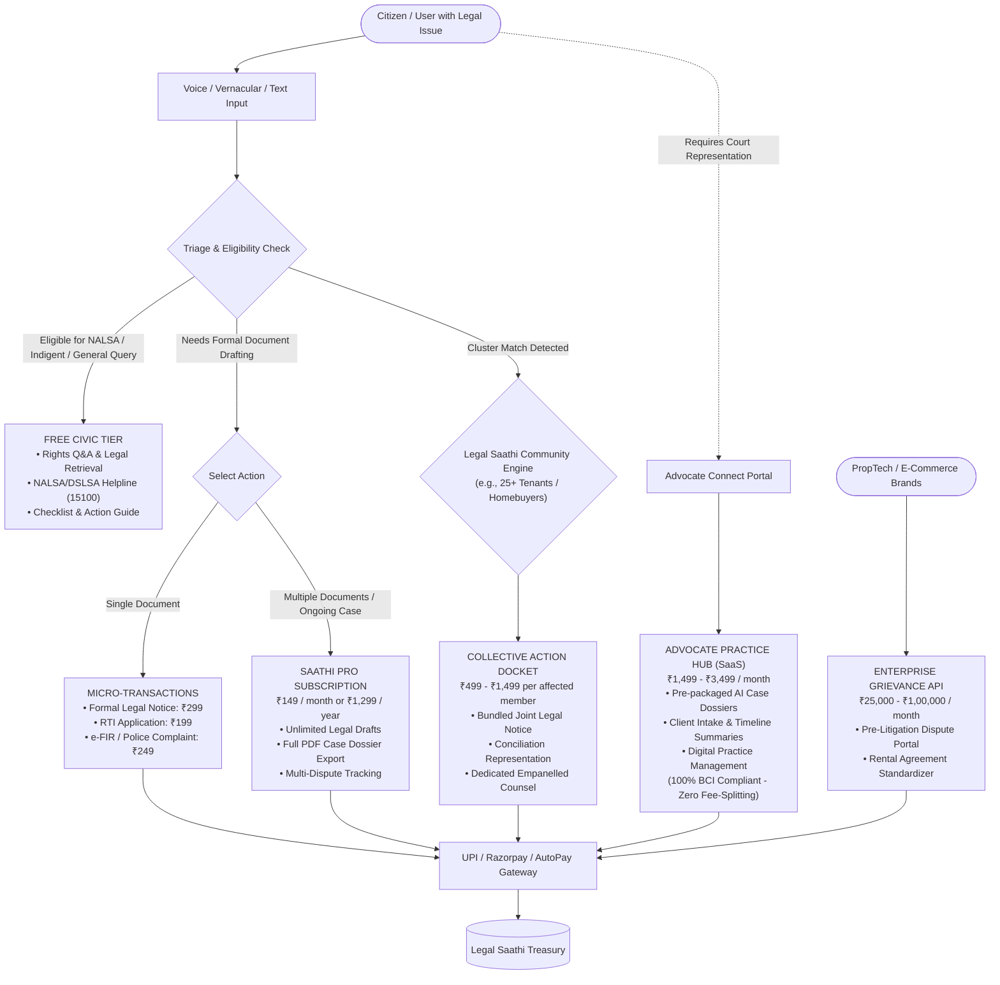

# Legal Saathi — Business & Revenue Architecture

**Version:** 1.0  
**Effective Date:** 2026-2027  
**Compliance Standard:** Advocates Act, 1961 & Bar Council of India (BCI) Rules  
**Core Model:** Hybrid Civic Freemium, Pay-Per-Action Micro-Transactions & Legal-Tech SaaS  

---

## 1. Executive Summary

Legal Saathi bridges India's justice delivery gap through a sustainable, high-margin, dual-engine commercial model:
1. **Public/Civic Mission:** Fundamental rights literacy, legal search, and government legal aid routing (NALSA / DSLSA) remain **100% free forever** for every citizen.
2. **Commercial Monetization:** High-converting micro-transactions for automated statutory drafting, collective consumer action pooling, and an advocate practice management SaaS that bypasses BCI fee-splitting restrictions.

---

## 2. Monetization Funnel & Flowchart



---

## 3. Structured Revenue System: Tiers, Subscriptions & Fees

### Tier 1: Bharat Civic Access (Free Tier)
*Target: Common citizens, students, rural litigants, marginalized groups.*

| Parameter | Specification |
|---|---|
| **Price** | **₹0 (Free Forever)** |
| **Voice & Chat Queries** | Unlimited preliminary legal queries in 10+ Indic languages |
| **Statutory Retrieval** | Full access to Central Bare Acts, BNS/BNSS/BSA, RERA, CPA, and SC citations |
| **Legal Aid Routing** | Direct routing to NALSA / DLSA toll-free (`15100`) and district court legal aid cells |
| **Basic Checklist** | Step-by-step guidance checklist for resolving disputes informally |

---

### Tier 2: Pay-Per-Action (A La Carte Micro-Transactions)
*Target: Users with an immediate, one-off dispute (e.g., security deposit withheld, broken e-commerce product).*

| Service Module | Price (INR) | What is Delivered |
|---|---|---|
| **Demand / Legal Notice Generator** | **₹299** | Complete lawyer-formatted legal notice with statutory demand clauses, 15-day cure period, formatted for Registered Speed Post with tracking slip space. |
| **RTI Application & Appeal Pack** | **₹199** | Formatted Form-A RTI request with jurisdictional CPIO address, court fee stamp guidelines, and draft First Appeal under Sec 19(1). |
| **e-FIR & Police Complaint Dossier** | **₹249** | Structured criminal complaint with chronological incident timeline, penal code sections (BNS/IPC), witness list, and evidence annexures index. |
| **Certified Speed Post Delivery Add-on** | **₹199** *(Optional)* | Physical printing, registered speed post dispatch via India Post integration, and delivery tracking receipt uploaded to user dashboard. |

---

### Tier 3: Saathi Pro (Citizen Subscription)
*Target: Active tenants, frequent online consumers, gig workers, small business owners.*

| Billing Frequency | Price (INR) | Effective Monthly Cost | Discount |
|---|---|---|---|
| **Monthly Subscription** | **₹149 / mo** | ₹149 / mo | Standard |
| **Quarterly Subscription** | **₹399 / quarter** | ₹133 / mo | ~11% Off |
| **Annual Pass** | **₹1,299 / year** | ₹108 / mo | ~28% Off |

**Features Included in Saathi Pro:**
* Unlimited document drafting (Notices, RTI, Complaints, Eviction responses).
* Export complete **Case Brief Dossier** (PDF summary, facts timeline, evidence checklist, statutory authorities) to share with an advocate.
* Continuous case tracking with notification alerts on statutory limitation deadlines (e.g., 30-day cheque bounce notice window, 2-year consumer court limitation).
* Priority GPU-accelerated voice processing.

---

### Tier 4: Community Engine & Collective Action Docket
*Target: Clustered victims facing institutional fraud (unreturned tenant deposits, delayed builder possession, mass e-commerce cancellations).*

* **Pricing:** **₹499 to ₹1,499 per affected claimant** (scaled by claim value).
* **The Value Proposition:**
  * Hiring an individual advocate for RERA or Consumer Court costs ₹25,000–₹50,000 per person.
  * When Legal Saathi clusters 20–100 claimants together, each user pays only ₹999.
* **Deliverables:**
  * Consolidated group legal notice served to the opposing builder, corporation, or landlord.
  * Direct representation through empanelled partner legal chambers in the Consumer Commission (CCPA) or RERA Authority.
  * Group status dashboard tracking conciliation meetings and settlement disbursements.

---

### Tier 5: Advocate Practice Hub (Legal Professional SaaS)
*Target: Practicing advocates, junior litigators, independent legal clinics.*

> [!IMPORTANT]
> **Bar Council of India (BCI) Compliance:** Under Rule 36 of BCI Rules, advocates cannot advertise or pay referral commissions. Legal Saathi **does NOT take commission cuts** on legal fees. Advocates pay strictly for **Practice Management & Intake Workflow Technology**.

| Plan | Price (INR) | Target | Features Included |
|---|---|---|---|
| **Advocate Starter** | **₹1,499 / mo**<br>*(₹14,999 / yr)* | Solo practitioners & junior advocates | • Up to 15 AI-pre-screened client intake dossiers/month.<br>• Automated chronology generator and document analyzer.<br>• Basic profile listing in verified court directory. |
| **Chambers Pro** | **₹3,499 / mo**<br>*(₹34,999 / yr)* | Mid-size law chambers & partnerships | • Unlimited client intake dossiers.<br>• Multi-user team access (up to 5 junior associates).<br>• Access to Collective Action dispute dockets.<br>• Automated cause-list tracker and e-Court hearing alerts. |

---

### Tier 6: Enterprise & B2B Solutions
*Target: PropTech companies, co-living operators, e-commerce giants, fintech lenders.*

* **Enterprise Pre-Litigation Dispute API (₹25,000 – ₹1,00,000 / month):**
  * E-commerce and fintech companies connect to Legal Saathi to resolve customer complaints in early mediation before they reach e-Daakhil consumer courts.
* **PropTech Compliance Engine (₹50 – ₹100 per tenancy agreement):**
  * Co-living operators (e.g., Stanza Living, Zolo, NestAway) integrate Legal Saathi's contract review engine to ensure lease agreement compliance under the Model Tenancy Act.

---

## 4. Feature Matrix by Tier

| Feature | Free Tier | Pay-Per-Action | Saathi Pro | Advocate Hub | Enterprise |
|---|:---:|:---:|:---:|:---:|:---:|
| Voice & Text Legal Q&A | Unlimited | Unlimited | Unlimited | Unlimited | API Access |
| Statutory Citations & Verification | Yes | Yes | Yes | Yes | Yes |
| NALSA / DLSA Helpline Routing | Yes | Yes | Yes | Yes | Yes |
| Formal Document Drafting | Previews Only | 1 Full Doc | Unlimited | Unlimited | Bulk API |
| Full Case Dossier PDF Export | No | No | Yes | Yes | Yes |
| Collective Action Clustering | View Only | View Only | Priority Opt-In | Lead Counsel Access | Dashboard |
| Client Intake Dossier Reception | N/A | N/A | N/A | Yes | Custom |
| Multi-seat Team Collaboration | No | No | No | Up to 5 Seats | Unlimited |
| India Post Speed Post Dispatch | No | Optional (+₹199) | 1 Free/mo | Custom | Integrated |

---

## 5. Unit Economics & 3-Year Projections

### Unit Economics (Per Transaction)
* **Average Pay-Per-Action Price:** ₹299
* **Inference & Hosting Cost per Document:** ₹4.50 (Google Gemini Flash + Serverless)
* **Payment Gateway Fee (2% Razorpay + GST):** ₹7.05
* **Gross Margin per Document:** **~96.1%**

### Year 1 – Year 3 Financial Trajectory (INR Projected)

```text
Revenue Breakdown (Projection)
──────────────────────────────────────────────────────────────
Year 1 (MVP & Hackathon Launch):
  • 15,000 Micro-Transactions (@ ₹299 avg)   : ₹44.85 Lakhs
  • 1,200 Saathi Pro Annual Subs (@ ₹1,299)  : ₹15.58 Lakhs
  • 150 Advocates on Practice SaaS (@ ₹14,999): ₹22.50 Lakhs
  • 5 Collective Dockets (300 users @ ₹999)  : ₹2.99 Lakhs
  Total ARR Year 1:                           ~₹85.92 Lakhs (~$105K USD)

Year 2 (Expansion to 8 Metros):
  • 85,000 Micro-Transactions                : ₹2.54 Crores
  • 8,500 Pro Subscribers                    : ₹1.10 Crores
  • 1,200 Advocates on SaaS                  : ₹1.80 Crores
  • 40 Collective Dockets                    : ₹0.48 Crores
  Total ARR Year 2:                           ~₹5.92 Crores (~$710K USD)

Year 3 (Pan-India Scale + Enterprise APIs):
  • Projected ARR                            : ~₹22.5 Crores (~$2.7M USD)
──────────────────────────────────────────────────────────────
```

---

## 6. Payment Infrastructure & Technical Implementation

* **Payment Rails:** UPI Intent, UPI AutoPay (for subscriptions), Net Banking, RuPay/Visa/MasterCard credit/debit cards via **Razorpay / Cashfree**.
* **Billing System:**
  * Automated GST-compliant invoicing (SAC Code `998311` - Legal Advisory & Documentation Automation).
  * Webhook listener on `/api/v1/billing/webhook` to unlock pro features instantly upon payment confirmation.
* **Refund Policy:** 100% money-back guarantee within 48 hours if an automated draft fails to match the statutory format specified by the Indian courts.

---

## 7. Technical Classification: Backend vs Frontend Architecture

```
REVENUE & BILLING ARCHITECTURE
├── BACKEND (FastAPI + SQLite/Postgres + Razorpay)
│   ├── Database Models (Subscriptions, Orders, Invoices, Entitlements)
│   ├── API Endpoints (/billing/plans, /checkout, /webhook, /entitlements)
│   ├── Payment & Webhook Services (Signature verification, Idempotency)
│   ├── Access Gatekeeper Middleware (Tier checking, Feature flags)
│   └── GST Invoicing Engine (SAC 998311 automated PDFs)
│
└── FRONTEND (React / Next.js / Vite / Tailwind)
    ├── UI Screens (Pricing Table, Paywall Modal, Checkout Sheet)
    ├── Component Layer (PlanCard, RazorpayButton, FeatureGate, InvoiceTable)
    ├── State & Hooks (useSubscription, useCheckout, useEntitlement)
    ├── Razorpay Checkout Client Integration (UPI AutoPay, Cards, NetBanking)
    └── Type Definitions (Plan, Subscription, Transaction, FeatureFlag)
```

### 7.1 Backend Structure

#### A. Database Schema (`backend/data/db.py`)
```sql
-- 1. Subscription Plans Master
CREATE TABLE IF NOT EXISTS subscription_plans (
    plan_id TEXT PRIMARY KEY,               -- 'plan_free', 'plan_pro_monthly', 'plan_advocate_starter'
    name TEXT NOT NULL,                     -- 'Saathi Pro', 'Advocate Hub'
    tier TEXT NOT NULL,                     -- 'civic', 'pro', 'advocate', 'enterprise'
    amount_inr INTEGER NOT NULL,            -- in paise (e.g. 14900 for ₹149.00)
    billing_period TEXT NOT NULL,           -- 'one_time', 'monthly', 'annual'
    features_json TEXT NOT NULL             -- JSON array of allowed entitlements
);

-- 2. User Subscriptions Table
CREATE TABLE IF NOT EXISTS user_subscriptions (
    subscription_id TEXT PRIMARY KEY,       -- 'sub_abc123'
    user_id TEXT NOT NULL,
    plan_id TEXT NOT NULL,
    status TEXT NOT NULL,                   -- 'active', 'past_due', 'cancelled', 'expired'
    current_period_start TEXT NOT NULL,
    current_period_end TEXT NOT NULL,
    gateway_subscription_id TEXT,           -- Razorpay sub_id for UPI AutoPay
    cancel_at_period_end INTEGER DEFAULT 0,
    created_at TEXT NOT NULL,
    FOREIGN KEY (plan_id) REFERENCES subscription_plans(plan_id)
);

-- 3. Transactions & Orders (Micro-transactions + Subscriptions)
CREATE TABLE IF NOT EXISTS payment_orders (
    order_id TEXT PRIMARY KEY,              -- 'order_internal_xyz'
    user_id TEXT NOT NULL,
    gateway_order_id TEXT UNIQUE,           -- Razorpay order_id
    item_type TEXT NOT NULL,                -- 'subscription', 'notice_draft', 'rti_draft', 'collective_docket'
    item_ref_id TEXT,                       -- case_id or cluster_id
    amount_inr INTEGER NOT NULL,            -- in paise
    currency TEXT DEFAULT 'INR',
    status TEXT NOT NULL,                   -- 'created', 'paid', 'failed', 'refunded'
    signature TEXT,
    created_at TEXT NOT NULL,
    paid_at TEXT
);

-- 4. Invoices Table (GST Invoicing)
CREATE TABLE IF NOT EXISTS invoices (
    invoice_id TEXT PRIMARY KEY,            -- 'INV-2026-0001'
    order_id TEXT UNIQUE,
    user_id TEXT NOT NULL,
    base_amount_inr INTEGER NOT NULL,
    gst_rate REAL DEFAULT 0.18,             -- 18% GST (SAC 998311)
    gst_amount_inr INTEGER NOT NULL,
    total_amount_inr INTEGER NOT NULL,
    invoice_pdf_url TEXT,
    created_at TEXT NOT NULL,
    FOREIGN KEY (order_id) REFERENCES payment_orders(order_id)
);
```

#### B. API Endpoints (`backend/routers/billing.py`)
| Method | Endpoint | Description | Auth Required |
|---|---|---|:---:|
| `GET` | `/api/v1/billing/plans` | Returns available public pricing plans and features | No |
| `POST` | `/api/v1/billing/checkout` | Creates a Razorpay payment order for subscription or single doc | Yes |
| `POST` | `/api/v1/billing/verify` | Verifies Razorpay payment signature & unlocks entitlement | Yes |
| `POST` | `/api/v1/billing/webhook` | Asynchronous webhook receiver for recurring payments & failures | Gateway Secret |
| `GET` | `/api/v1/billing/subscription` | Returns current user's active plan, expiry, and usage limits | Yes |
| `GET` | `/api/v1/billing/invoices` | Lists user's tax invoices and download URLs | Yes |

#### C. Entitlement Middleware (`backend/core/entitlements.py`)
```python
# Access gate dependency in FastAPI
async def require_entitlement(feature: str, user: User = Depends(get_current_user)):
    user_plan = get_user_active_plan(user.id)
    if not has_feature_access(user_plan, feature):
        raise HTTPException(
            status_code=402, 
            detail={"error": "PAYMENT_REQUIRED", "required_plan": "pro", "feature": feature}
        )
```

---

### 7.2 Frontend Structure

#### A. Folder & Component Hierarchy
```text
frontend/
├── src/
│   ├── components/billing/
│   │   ├── PricingTable.tsx          # Full comparison matrix of Free vs Pro vs Advocate
│   │   ├── PlanCard.tsx              # Individual tier card with CTA & billing toggle
│   │   ├── PaywallModal.tsx          # Non-blocking upgrade modal when hitting a pro feature
│   │   ├── RazorpayCheckout.tsx      # Headless handler invoking Razorpay Standard/UPI SDK
│   │   ├── InvoiceHistory.tsx        # Table of past receipts with PDF download button
│   │   └── CollectiveContribution.tsx# Pool payment card for clustered group action (₹499-₹1499)
│   │
│   ├── hooks/
│   │   ├── useSubscription.ts        # SWR/React Query hook fetching current user's active tier
│   │   ├── useCheckout.ts            # Initiates checkout order & loads Razorpay script
│   │   └── useEntitlement.ts         # Boolean helper: canDraftNotice(), canExportDossier()
│   │
│   ├── types/
│   │   └── billing.ts                # TypeScript interfaces: Plan, Order, Subscription, Invoice
│   │
│   └── views/
│       ├── PricingPage.tsx           # Standalone public pricing page
│       └── AccountBillingTab.tsx     # Settings tab for managing AutoPay card & cancelations
```

#### B. TypeScript Interfaces (`frontend/src/types/billing.ts`)
```typescript
export type PlanTier = 'civic' | 'pro' | 'advocate' | 'enterprise';
export type BillingPeriod = 'one_time' | 'monthly' | 'annual';

export interface Plan {
  planId: string;
  name: string;
  tier: PlanTier;
  amountInr: number; // in Rupees
  period: BillingPeriod;
  highlighted?: boolean;
  features: string[];
}

export interface UserSubscriptionState {
  tier: PlanTier;
  planName: string;
  isActive: boolean;
  renewsOn: string | null;
  allowedDraftsRemaining: number | 'unlimited';
  canExportPdfDossier: boolean;
  canAccessCollectiveDockets: boolean;
}

export interface CheckoutPayload {
  itemType: 'subscription' | 'notice_draft' | 'rti_draft' | 'collective_docket';
  planId?: string;
  caseId?: string;
  clusterId?: string;
}
```

#### C. User Experience (UX) Paywall Trigger Flow
1. **Free Usage:** User chats with AI, gets full legal citations and statutory explanation for ₹0.
2. **Action Trigger:** User clicks **"Generate Legal Notice PDF"** or **"Export Advocate Case Brief"**.
3. **Paywall Check (`useEntitlement`):**
   * If user is **Saathi Pro** → Document downloads immediately.
   * If user is on **Free Tier** → Renders lightweight `<PaywallModal />` offering two clear choices:
     * **Option A:** Pay ₹299 once for this specific legal notice.
     * **Option B:** Upgrade to Saathi Pro for ₹149/month for unlimited documents.
4. **Seamless Payment:** Razorpay modal opens with pre-filled mobile number and instant **UPI Intent (GPay/PhonePe/Paytm)**.
5. **Instant Unlock:** Webhook/verify API completes in <500ms; PDF unlocks and downloads automatically.

